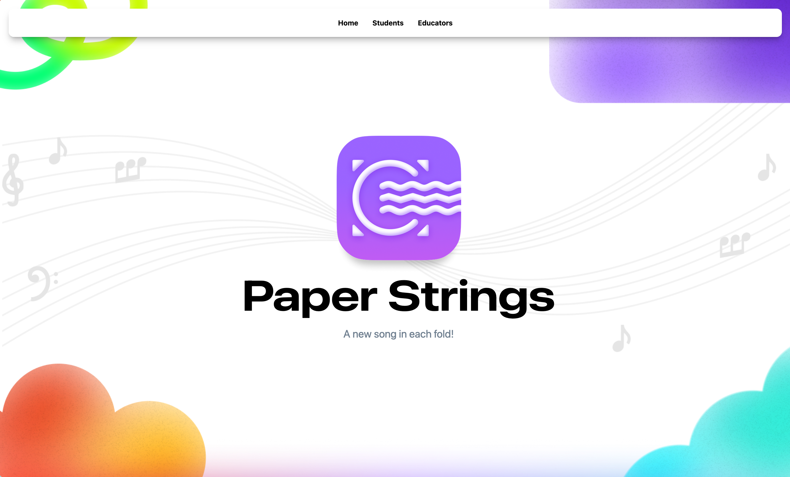
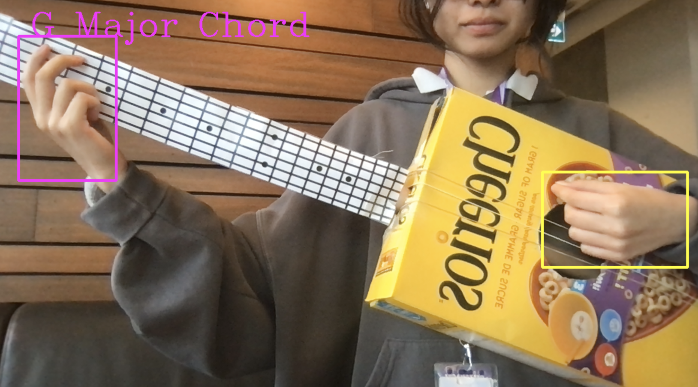

# Paper Strings

Paper Strings allows anyone in the world to learn the guitar anytime, anywhere.

Submission for DeltaHacks XI by Stephanie Li, Natalia Guevara, Lucas Leung, and Ameya Gupta
Backend: MediaPipe, Keras, OpenCV, PyGlet, TensorFlow, and Streamlit
Frontend: React, Tailwind, TypeScript, and Figma

[Presentation Link](https://www.figma.com/slides/4SAgxsa3RNefr9k72zdYkA/paper-strings-pres-deltahack?node-id=1-29&t=5QzkUPEMobap4Q2M-1 )
